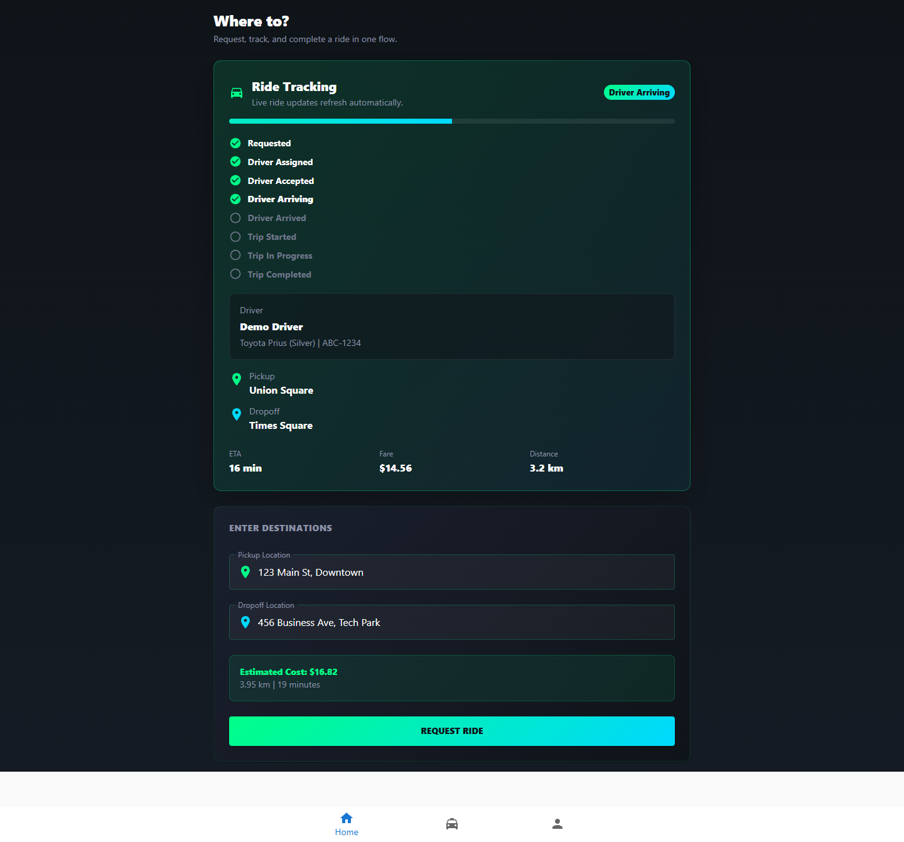
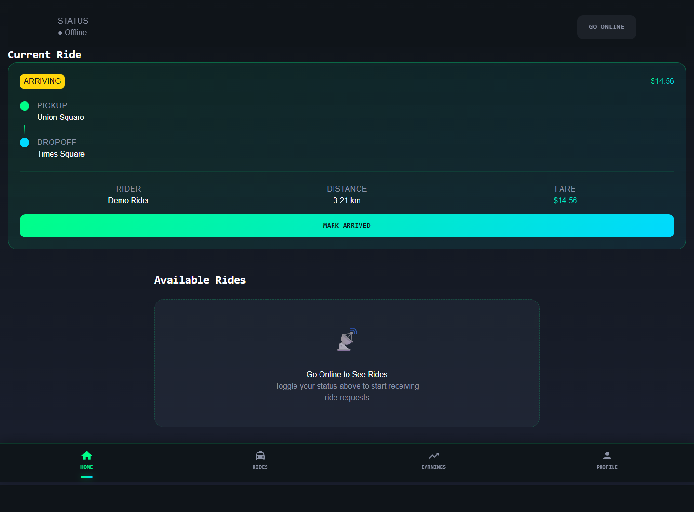
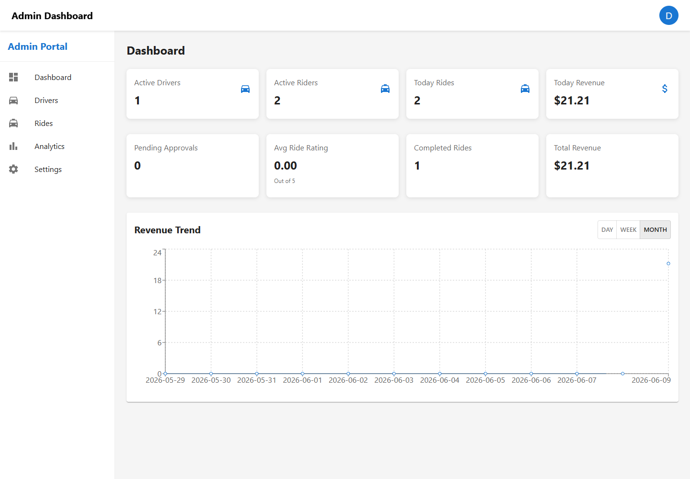

# Ride Matching Platform

<p align="center">
  <strong>Production-grade ride dispatch, live trip tracking, and operator tooling for a multi-app mobility platform.</strong>
</p>

<p align="center">
  
  
  
  
</p>

<p align="center">
  An enterprise-grade ride-sharing ecosystem delivering rider booking, driver dispatch, live tracking, trip analytics, and admin operations through a modular full-stack architecture.
</p>

---

## Vision

This platform was built to model the operational core of a modern mobility company: turn a rider request into a matched driver, continuously synchronize state across multiple clients, and give operators enough visibility to manage the network with confidence.

The emphasis is not just on UI polish. The system is structured around the kinds of concerns that matter in production:

- fast ride state transitions
- clear separation between rider, driver, and admin experiences
- real-time updates that feel trustworthy
- data flows that can be reasoned about and extended
- operational surfaces for analytics, monitoring, and management

The result is a portfolio project designed to read like a working mobility product, not a demo.

---

## Key Features

### Rider Experience

- Real-time ride booking with global location search
- Animated ride flow with matching, arrival, pickup, and trip states
- Live ETA updates and route visualization
- Driver profile cards with vehicle and rating details
- Trip history and ride receipts
- Secure auth flow with protected routes

### Driver Experience

- Instant ride request handling
- Accept / decline workflow
- Active trip dashboard
- Earnings and trip summaries
- Pickup and destination progress states
- Mobile-first operator layout for day-to-day dispatch work

### Admin Dashboard

- Fleet and user management views
- Ride analytics and revenue insights
- Operational summary panels
- Search, filters, sorting, and pagination patterns
- Production-style dashboard layout for quick scanning

---

## Architecture

The repository is organized as a multi-app mobility platform with a clear separation of concerns.

### Frontend

- `frontend/rider-app`
- `frontend/driver-app`
- `frontend/admin-app`

Each app is independently buildable and optimized for a distinct operational role. The rider app focuses on booking and live trip state. The driver app emphasizes request handling and trip execution. The admin app centers on operational visibility and management workflows.

### Backend

- `backend/*-service`
- `backend-complete.js` for the integrated API surface used in local development and demos

The backend models the core domain boundaries of a ridesharing platform: authentication, rides, drivers, matching, location, ETA, and notifications.

### Database

- Persistent ride, user, and driver state
- Historical trip storage and analytics inputs
- Seeded data for reproducible demos and development

### APIs

- REST endpoints for auth, ride creation, ride history, driver actions, and admin operations
- Clean request/response contracts
- Browser-friendly integration for the three frontends

### Authentication

- Role-aware auth flow
- Protected routes on the client
- Token-based session handling
- Demo login support for fast evaluation

### Real-Time Communication

- Live ride state synchronization
- Driver matching progression
- ETA and trip lifecycle updates
- UI-driven simulation for dispatch and trip motion

---

## Tech Stack

| Layer | Technologies | Notes |
|---|---|---|
| Frontend | React, TypeScript, MUI, Framer Motion | Three separate apps with responsive ride workflows and motion-driven UX |
| Styling | Utility-first design patterns, component-driven layout | Production-friendly UI composition with consistent spacing and hierarchy |
| Maps / Location | Location search abstraction, geolocation, route visualization | Global search, pickup/destination markers, animated movement |
| Backend | Node.js, Express | API layer used for ride, auth, driver, and admin workflows |
| Database | JSON-backed seeded state, extensible relational modeling | Demo-friendly persistence with a path toward PostgreSQL / MongoDB deployment |
| Realtime | WebSockets / live polling patterns | Supports live trip progression and immediate UI updates |
| Deployment | Docker, multi-app workspace, cloud-ready structure | Designed for local development and containerized rollout |

---

## System Workflow

1. Rider requests a ride from the app.
2. The system locates and notifies nearby drivers.
3. A driver accepts the request.
4. The driver is routed to pickup with live ETA updates.
5. The rider and driver transition through pickup and trip-start states.
6. The trip progresses to destination with remaining distance and duration updates.
7. Payment, summaries, analytics, and operational metrics are updated after completion.

This flow is intentionally visible in the UI so the product feels like a real dispatch system instead of a static screen.

---

## Scalability & Engineering

- Modular frontend boundaries across rider, driver, and admin experiences
- Clean component decomposition and shared domain types
- Real-time synchronization patterns for ride state changes
- Responsive interfaces that hold up on desktop and mobile
- Secure API boundaries with protected routes and role-aware flows
- Production-oriented operational surfaces for metrics and admin control
- Motion and feedback tuned for clarity rather than decoration

The codebase is suitable for demonstrating how to think about product, workflow, and system design at the same time.

---

## Future Roadmap

- AI-based surge pricing
- Demand prediction and supply balancing
- Carpooling and pooled trip optimization
- EV-aware vehicle routing and charging awareness
- Fraud detection and abuse prevention
- ML-powered dispatching and driver ranking
- Better observability and tracing for operational confidence
- Expanded payment and settlement flows

---

## Installation

### Prerequisites

- Node.js 20+
- npm
- Java 21 for backend service development

### Frontend

```bash
cd frontend/rider-app
npm install
npm run dev
```

Repeat the same pattern for:

```bash
cd frontend/driver-app
npm install
npm run dev
```

```bash
cd frontend/admin-app
npm install
npm run dev
```

### Backend

```bash
cd backend
```

Run the relevant service or integrated local backend depending on your development flow.

### Build

```bash
cd frontend/rider-app
npm run build
```

---

## Screenshots

### Rider App



### Driver App



### Admin Dashboard



---

## Why This Project Stands Out

This repository is designed to communicate engineering judgment:

- three distinct user surfaces with their own workflows
- live ride state rendered as an operational system
- clean separation between product experience and domain logic
- admin tooling that reflects how teams actually run a platform
- enough architectural framing to show how the system scales beyond a demo

It is meant to be reviewed the way a recruiter, founder, or engineering manager would read a real product launch repo.

---

## Repository Notes

- `backend-complete.js` is the integrated backend used for local development and demo flows.
- The `backend/` directory contains service-oriented backend structure.
- The `frontend/` directory contains the rider, driver, and admin applications.
- Seed data and screenshots are included to make the repository immediately explorable.

---

## Contact

If you are reviewing this project for hiring, product evaluation, or technical diligence, the important signal is simple:

this codebase is built to demonstrate production thinking, not just implementation.

